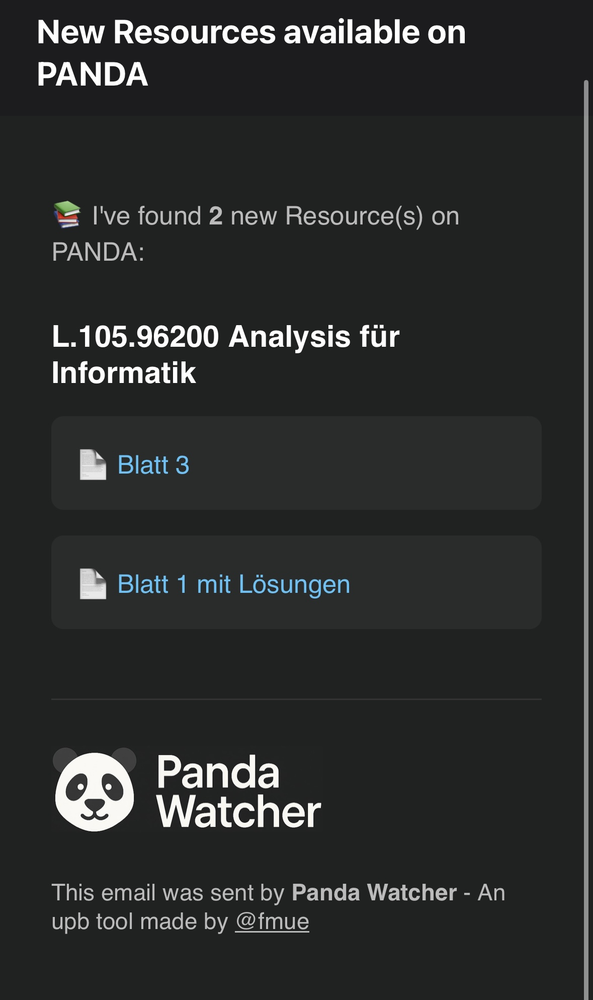

# PandaWatcher



PandaWatcher is a monitoring tool for the PANDA Moodle platform of the University of Paderborn. It checks selected courses for newly uploaded resources and sends notification emails to predefined recipients.

## Features

- Automatic login using Selenium
- Detection of newly uploaded files in specified PANDA courses
- Email notifications via AWS SES
- Hash-based deduplication to avoid repeated alerts

## Setup

### 1. Requirements

- Python 3.10 or newer
- AWS account with Simple Email Service (SES) enabled
- Google Chrome and chromedriver (via `webdriver-manager`)

### 2. Installation

Clone the repository and create a virtual environment:

```bash
git clone https://github.com/felixmff/panda-watcher.git
cd panda-watcher

python -m venv venv
source venv/bin/activate  # use 'venv\Scripts\activate' on Windows

pip install -r requirements.txt
```

### 3. Environment variables

Create a `.env` file in the root directory with the following content:

```
PANDA_USERNAME=your_uni_login
PANDA_PASSWORD=your_password
AWS_REGION=eu-central-1
AWS_ACCESS_KEY_ID=your_aws_access_key
AWS_SECRET_ACCESS_KEY=your_aws_secret_key
SES_FROM_ADDRESS=your_verified_email@example.com
SES_FROM_NAME=PandaWatcher
```


## Configuration

The file `config/config.json` defines which courses are monitored and which email addresses should receive notifications:

```json
{
  "course_ids": ["123456", "654321"],
  "notify_emails": ["you@example.com", "another@example.com"]
}
```

## Running

To run the program manually:

```bash
python main.py
```

The tool will check all configured courses and send an email if new resources are detected.

### Scheduled execution via Cron (Linux)

To run the script automatically every hour using cron:

1. Open your crontab:

```bash
crontab -e
```

2. Add the following line:

```cron
0 * * * * /path/to/your/project/venv/bin/python /path/to/your/project/main.py
```

Replace `/path/to/your/project/` with the absolute path to your local project. If using a virtual environment, ensure that the correct Python path is referenced.

## Project structure

```
panda-watcher/
├── watcher/
│   ├── watcher.py              # Coordinates login, resource checks and notifications
│   ├── panda.py                # Handles PANDA login and resource scraping
│   ├── hashing.py              # Computes and compares resource hashes
│   └── mailing.py              # Sends notification emails using AWS SES
├── main.py                     # Entry point
├── config/config.json          # Course and recipient configuration
├── data/previous_hashes.json   # Persistent store of known resource hashes
├── templates/notification.html # HTML email template
├── README.md                   # Project documentation
```
